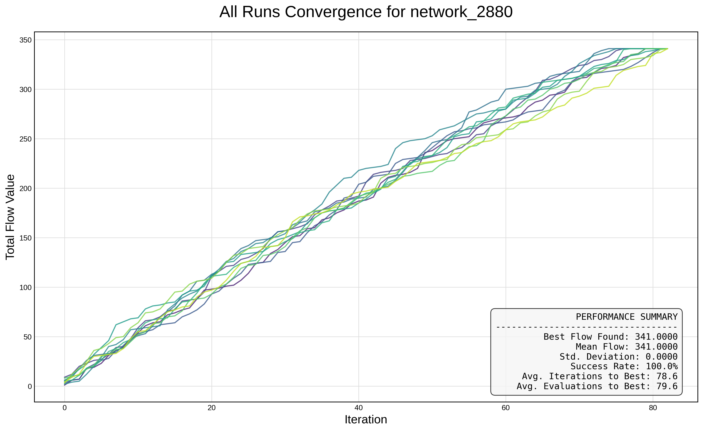
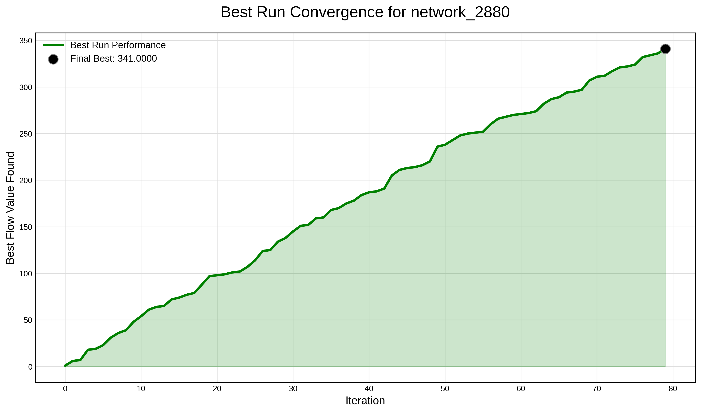

# 🚀 Advanced Tabu Search for the Maximum Flow Problem

[](https://opensource.org/licenses/MIT)
[](https://www.python.org/downloads/)

## 🔎 Problem Formalization

The **Maximum Flow Problem (MFP)** is a classical combinatorial optimization problem with numerous real-world applications in transportation, telecommunication, and resource allocation.

Given a directed graph **G = (V, E)** with positive capacities **c(u, v)** associated with each edge **(u, v) ∈ E**, the objective is to determine the **maximum flow** that can be sent from a **source node** `s ∈ V` to a **sink node** `t ∈ V`, subject to the following constraints:

1. **Capacity Constraints**:  
   For all edges (u, v) ∈ E:  
   `0 ≤ f(u, v) ≤ c(u, v)`

2. **Flow Conservation**:  
   For every node `v ∈ V \ {s, t}`, the total incoming flow must equal the total outgoing flow:  
   `∑_{(u,v)∈E} f(u, v) = ∑_{(v,w)∈E} f(v, w)`

3. **Objective Function**:  
   Maximize the total flow sent from the source:  
   `Maximize ∑_{(s,v)∈E} f(s, v)`

This formal structure ensures the solution complies with both physical feasibility (capacity limits) and logical consistency (flow conservation), while optimizing the global objective of maximizing flow throughput from source to sink.

## Key Features

- **Advanced Tabu Search Core**: Implements a powerful TS algorithm with three distinct memory systems for a balanced search strategy.
- **Adaptive Search Strategies**: Dynamically alternates between **intensification** (deepening the search in promising regions) and **diversification** (exploring new areas) based on search stagnation.
- **Multi-layered Memory System**:
  - **Short-Term Memory**: A classic Tabu List to prevent cycles by forbidding recent moves (based on bottleneck edges).
  - **Long-Term Memory**: A frequency-based memory that penalizes frequently used moves to encourage diversification over the entire search history.
  - **Intermediate Memory**: An elite solutions archive to store the best-found solutions, used as starting points for intensification phases.
- **Parallel Execution**: Leverages Python's `multiprocessing` to run multiple experimental trials in parallel, significantly speeding up data collection.
- **Extensive Configuration**: All algorithmic parameters, experimental settings, and visualization options are managed through a central `config.yaml` file.
- **Automated Analysis & Visualization**: Automatically generates detailed summary statistics, convergence plots for each run, and scalability analysis graphs.

## Project Structure

The project is organized into a modular structure for clarity and maintainability:

```
tabu-search-maxflow/
├── config.yaml               # Main configuration file
├── main.py                   # Entry point to run experiments
├── requirements.txt          # Project dependencies
├── LICENSE                   # Project license
├── README.md                 # This documentation file
├── data/
│   ├── networks/             # Input network instances (.txt)
│   └── results/              # Output directory for logs, plots, and stats
└── src/
    ├── algorithms/
    │   └── tabu_search.py    # Core Tabu Search implementation
    ├── data/
    │   └── network_reader.py # Utilities for reading network files
    ├── utils/
    │   └── logging_utils.py  # Advanced logging for parallel processes
    └── visualization/
        ├── plotter.py        # Generates convergence plots
        └── stats.py          # Generates summary/scalability plots
```

## Installation

1.  **Clone the repository:**
    ```bash
    git clone https://github.com/nameisalfio/tabu_search_maxflow.git
    cd tabu_search_maxflow
    ```

2.  **Install the required dependencies:**
    It is recommended to use a virtual environment.
    ```bash
    python -m venv venv
    source venv/bin/activate  # On Windows, use `venv\Scripts\activate`
    pip install -r requirements.txt
    ```

## Configuration

The entire experiment is controlled by the `config.yaml` file. Here you can define:
- **`tabu_search`**: Basic TS parameters like `max_iterations` and `tabu_list_size`.
- **`strategies`**: Thresholds for triggering intensification and diversification (`stagnation_limit`, `reset_limit`) and the number of `elite_solutions` to store.
- **`frequency`**: Settings for the long-term memory, such as the penalty factor `alpha`.
- **`experiments`**: Number of runs (`num_runs`) and the list of `random_seeds` for reproducibility.
- **`output`**: Directory for saving results and logging verbosity.
- **`visualization`**: Options to enable/disable plot generation and choose a style (`light` or `dark`).

## Usage

The main script `main.py` is used to launch the experiments.

#### Running on a Single Network Instance

To run the experiment on a specific network file:

```bash
python main.py --network data/networks/network_160.txt
```

#### Running on All Network Instances

To sequentially run the experiment for all network files in the `data/networks` directory:

```bash
python main.py --all
```

#### Enabling Parallel Execution

For multi-core systems, you can significantly speed up the experiments by running the trials for each instance in parallel. Add the `--parallel` flag to any of the commands above.

```bash
# Run all experiments in parallel mode
python main.py --all --parallel
```
The results, including detailed logs and plots, will be saved in the `data/results/` directory, organized into subfolders for each network instance.

## Results and Analysis

The project includes tools to automatically generate insightful visualizations from the experiment logs. The `stats.py` script aggregates data from all runs to produce summary plots.

### Convergence for Network 2880

Below are the convergence plots for the instance **network_2880**, showcasing the robustness and consistency of the Tabu Search approach:

#### 🔁 All Runs Convergence

This plot illustrates the convergence trends of all 10 runs. The algorithm consistently finds the optimal flow across different random seeds, with low variance in performance.



#### 🏆 Best Run Performance

The following plot shows the progression of the best-performing run out of the 10. It highlights how quickly and steadily the optimal flow value was reached.



### Scalability Analysis

The following plot illustrates the algorithm's scalability. It compares the mean number of iterations required to find the best solution against the number of edges for each network instance. This demonstrates how the algorithm's effort scales with problem size.


### Performance Correlation

This scatter plot shows the linear correlation between the number of edges in a network (a proxy for problem complexity) and the mean number of iterations needed. The strong positive correlation confirms that the computational effort grows predictably with the problem size.


In addition to these summary plots, detailed convergence graphs are generated for each instance, showing the performance of every single run and highlighting the best-performing one.

## License

This project is licensed under the MIT License. See the [LICENSE](LICENSE) file for details.